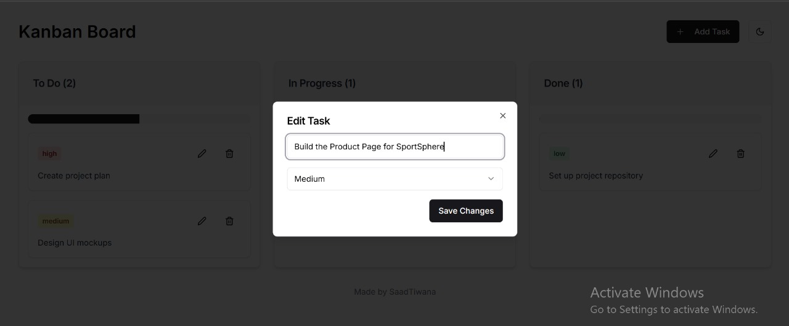

# Professional Kanban Board



This project is a modern, efficient Kanban board for professional task management, built with React.

## Features

- Drag-and-drop functionality for tasks
- Add, edit, and delete tasks
- Priority levels for tasks (low, medium, high)
- Progress tracking for each column
- Responsive design
- Local storage persistence

## Tech Stack

- **React**: JavaScript library for building user interfaces
- **react-beautiful-dnd**: Beautiful and accessible drag and drop for lists
- **Tailwind CSS**: Utility-first CSS framework
- **shadcn/ui**: Re-usable components built with Radix UI and Tailwind CSS
- **Lucide React**: Beautiful & consistent icon toolkit made by the community

## Getting Started

1. Clone the repository:
   ```sh
   git clone https://github.com/saadhtiwana/pro-kanban.git
   ```
2. Navigate to the project directory:
   ```sh
   cd pro-kanban
   ```
3. Install dependencies:
   ```sh
   npm install
   ```
4. Run the development server:
   ```sh
   npm start
   ```
5. Open [http://localhost:3000](http://localhost:3000) in your browser.

## Project Structure

- `src/`: Source files for the React application
  - `components/`: React components used in the application
  - `App.js`: Main application component
- `public/`: Public assets and `index.html`

## Key Components

- `KanbanBoard`: Main component managing the board state and layout
- `KanbanColumn`: Represents a single column in the Kanban board
- `TaskCard`: Individual task card component
- `AddTaskDialog`: Dialog for adding new tasks
- `TaskEditDialog`: Dialog for editing existing tasks

## Customization

You can customize the appearance of the Kanban board by modifying the Tailwind CSS classes in the components or adjusting the theme in the `tailwind.config.js` file.

## Author

Made by **Saad Tiwana**  
GitHub: [saadhtiwana](https://github.com/saadhtiwana)  
Email: [saadhayat799@gmail.com](mailto:saadhayat799@gmail.com)

## License

This project is open source and available under the [MIT License](LICENSE).
